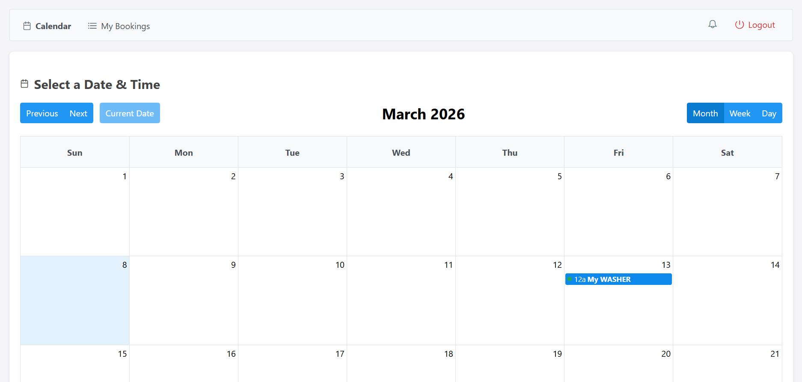
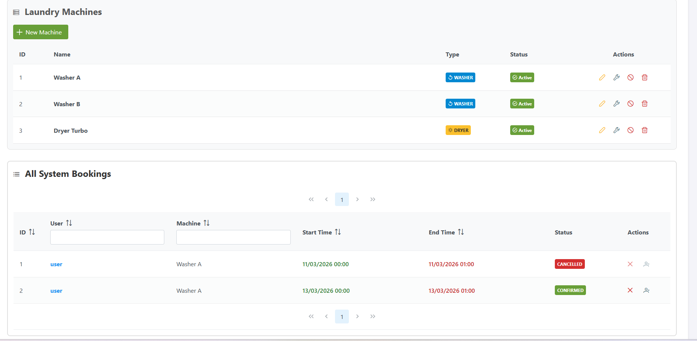
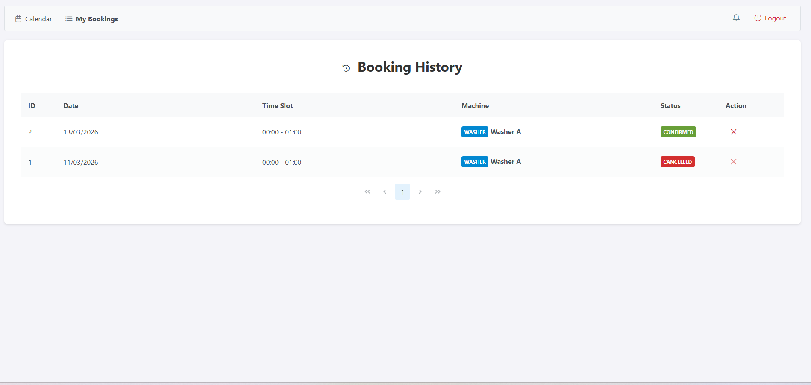

# 🧺 Laundry/Dryer Booking System (GJAe)

Laundry/Dryer Booking is a web application designed for university dormitories to manage laundry room usage efficiently. Developed for the **"Graphical User Interfaces in Java (in English) - GJAe"** course at **Brno University of Technology (FIT VUT)** during an **Erasmus+ mobility**.

The system helps residents organize laundry planning to avoid waiting for free machines and reduce coordination conflicts.

---

## 📸 Screenshots

| Booking Calendar | Manager Dashboard | My Bookings |
| :---: | :---: | :---: |
|  |  |  |

## 🚀 Key Features

### 👤 User Features
- **Authentication**: Secure user registration and login system.
- **Planning**: Calendar view to identify available machines on specific dates.
- **Reservation Management**: Functionality to create and cancel reservations.
- **History**: Tracking of active and cancelled booking history.
- **Notifications**: In-app alerts for important events like booking cancellations.

### 🛠 Manager Features
- **Machine Administration**: Tools to add, edit, enable/disable, or delete washing machines and dryers.
- **Maintenance**: Scheduling for technical downtime and maintenance.
- **Automation**: Automatic rescheduling or cancellation of bookings when a machine is modified or under maintenance.
- **User Oversight**: Capability for bulk cancellation of reservations for a selected user.

---

## 🧰 Tech Stack

- **Backend**: Java 17, Spring Boot, Spring Security, JPA/Hibernate  
- **Frontend**: JSF + PrimeFaces  
- **Database**: H2 (in-memory for development), with support for MySQL or PostgreSQL in production  
- **Build Tool**: Maven (including Maven Wrapper)

---

## 🏗 Installation & Setup

### 1️⃣ Clone the project
```bash
git clone https://github.com/LorenzoPed/GJAe.git
```

### 2️⃣ Build the project using Maven Wrapper
```bash
./mvnw clean install
```

### 3️⃣ Run the application
```bash
./mvnw spring-boot:run
```

### 4️⃣ Access the interface
Open your browser and go to:

```
http://localhost:8080/
```

---

## 👥 Authors

- **Lucas Labhini** (Team Leader)  
- **Lorenzo Pedroni**  
- **Adriana Grippi**  
- **Adam Selmane**

---

📍 Developed at **FIT VUT Brno** — 2025
